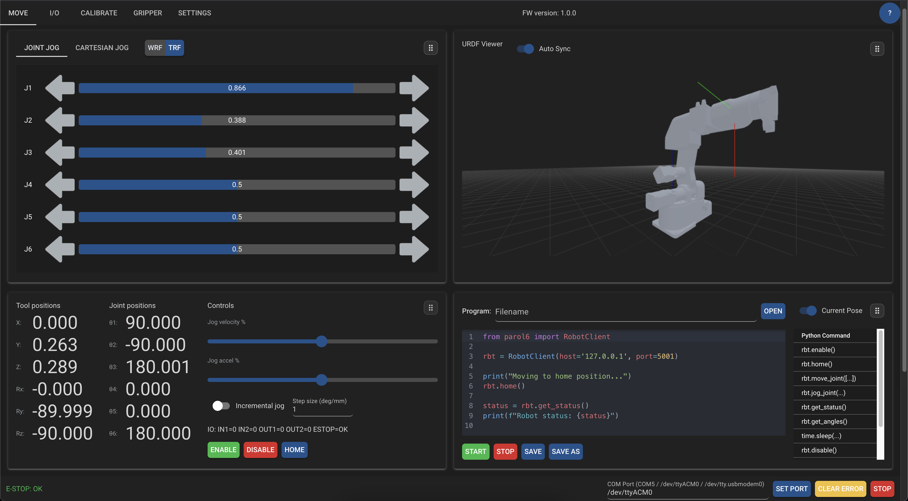

# PAROL-Web-Commander

A modern web interface for controlling the PAROL6 desktop robotic arm. This app provides a NiceGUI-based UI for jogging, monitoring I/O, running calibrations, and controlling grippers over the UDP-based PAROL6 headless controller.

This project integrates:
- Hardware: PAROL6 robot and control board
- Server: Headless controller from the PAROL6 Python API (UDP on port 5001 by default)
- Client: Async UDP client embedded in this web app
- UI: NiceGUI web frontend with live status and controls

Upstream projects and docs:
- PAROL6 hardware: https://github.com/PCrnjak/PAROL6-Desktop-robot-arm
- Commander software (GUI + docs): https://github.com/PCrnjak/PAROL-commander-software
- Python API (headless + UDP client): https://github.com/PCrnjak/PAROL6-python-API
- Official docs: https://source-robotics.github.io/PAROL-docs/

Note: To run a real robot, you must have a PAROL6 control board: https://source-robotics.com/products/parol6-control-board



## Features

- Live robot telemetry (joint angles, pose, I/O, gripper data)
- Joint and Cartesian jogging
- Calibration utilities
- Digital I/O control and status
- SSG-48 electric gripper control
- Auto status polling and E-stop status display
- URDF viewer with live joint visualization
- Uses UDP client/server from PAROL6 Python API for low-latency control

## How it fits together

- Headless controller (server)
  - Runs on the machine connected to the robot over USB/Serial
  - Listens for UDP commands on port 5001 (default)
  - Provided by the PAROL6 Python API (e.g., `headless_commander.py`)
- Web app (client + UI)
  - This repository runs a NiceGUI server
  - Renders control pages and sends commands via `parol6.AsyncRobotClient`
  - Manages the controller process via `parol6.ServerManager`
- Networking
  - Default controller host is `127.0.0.1:5001`
  - Can be reconfigured to a remote controller via environment variables

## Requirements

- Minimum/validated baseline: Raspberry Pi 5. This app and the headless controller are designed and frequently tested to sustain 100 Hz+ control loops on an RPi 5.
- Other supported platforms: x86_64 Linux, macOS, and Windows are supported for both the UI and the headless controller as long as timing targets and serial/USB requirements are met (performance depends on your CPU and OS).
- OS:
  - Controller: 64-bit Linux recommended (e.g., Raspberry Pi OS 64-bit Bookworm). Other OSes can work if they meet timing targets.
  - UI: Any modern OS with Python 3.11.
- Python: 3.11 (per `pyproject.toml`)
- Hardware: PAROL6 robot with PAROL6 control board connected via USB
- Notes:
  - Ensure your user has permission to access the serial device (e.g., add to the `dialout` group or set udev rules on Linux).
  - If running on lower-performance hardware, consider reducing polling rates and/or running the UI and controller on the same machine.

## Quick start (local controller + UI on the same PC)

1) Clone with submodules (required for external assets and references):
```bash
git clone --recurse-submodules https://github.com/Jepson2k/PAROL-Web-Commander.git
cd PAROL-Web-Commander
```

2) Create and activate a virtual environment (examples):

macOS/Linux:
```bash
python3.11 -m venv .venv
source .venv/bin/activate
```

Windows (PowerShell):
```powershell
py -3.11 -m venv .venv
. .\.venv\Scripts\Activate.ps1
```

3) Install dependencies for the web UI:
```bash
pip install -r app/requirements.txt
```

4) Install the PAROL6 Python API (provides the `parol6` package used by this app):
```bash
pip install -e external/PAROL6-python-API
```
This provides `AsyncRobotClient` and `ServerManager` used by the app.

Optional (URDF viewer package; the app already adds this to `sys.path` so installation is optional):
```bash
pip install -e external/urdf_scene_nicegui
```

5) Connect the robot via USB. Identify the port (examples):
- Windows: `COM5`
- Linux: `/dev/ttyACM0`
- macOS: `/dev/tty.usbmodemXXXX`

6) Run the web UI:
```bash
python -m app.main
```
Open the printed URL in your browser.

7) In the footer, set the COM port and click “Set Port”. The app will start the headless controller and begin polling status. Use the Move, I/O, Calibrate, Gripper, and Settings tabs as needed.

## Configuration

Environment variables (read in `app/constants.py`):

- `PAROL6_SERVER_HOST`: UDP host for the controller (default: `127.0.0.1`)
- `PAROL6_SERVER_PORT`: UDP port for the controller (default: `5001`)
- `PAROL6_UI_PORT`: NiceGUI HTTP port (default: `8080`)
- `PAROL6_COM_PORT`: Default serial port (optional, e.g. `COM5` or `/dev/ttyACM0`)
- `PAROL_LOG_LEVEL`: `DEBUG` | `INFO` | `WARNING` | `ERROR` | `CRITICAL` (default: `WARNING`)

Examples (macOS/Linux):
```bash
export PAROL6_SERVER_HOST=127.0.0.1
export PAROL6_SERVER_PORT=5001
export PAROL6_UI_PORT=8080
export PAROL6_COM_PORT=/dev/ttyACM0
export PAROL_LOG_LEVEL=INFO
```

Notes:
- The UI persists the last-used COM port in its local storage; you can also set it directly from the footer input field.
- The app instantiates `parol6.ServerManager()` to manage the headless controller process and `parol6.AsyncRobotClient()` to send commands/status queries.

## Remote controller scenario (advanced)

If your headless controller runs on a different machine:

1. Start the controller there using the PAROL6 Python API.
2. Ensure UDP port 5001 is open on the controller host.
3. Run this web app on any machine and set:
   - `PAROL6_SERVER_HOST` to the controller’s IP (e.g. `192.168.1.100`)
   - `PAROL6_SERVER_PORT` as needed (default `5001`)

For best results and fewer timing issues, run the web app and controller on the same machine connected to the robot.

## Development and tests

Install dev extras:
```bash
pip install -e .[dev]
```

Run linters and tests:
```bash
ruff check .
mypy .
pytest
```

Project config:
- `pyproject.toml` configures `pytest`, `ruff`, and `mypy`.
- Pre-commit hooks are defined in `.pre-commit-config.yaml`.

## Safety and liability

- Always have physical E-Stop accessible. Keep work area clear.
- Software safeguards are not a substitute for safe operating practice. Use at your own risk.

## Credits and licensing

- Hardware: PAROL6 by Source Robotics (see upstream repos)
- Software: This UI builds on the open-source PAROL6 ecosystem:
  - PAROL6-Desktop-robot-arm
  - PAROL-commander-software
  - PAROL6-python-API
- Licensing follows the terms of the upstream components; see LICENSE files in those repositories.
