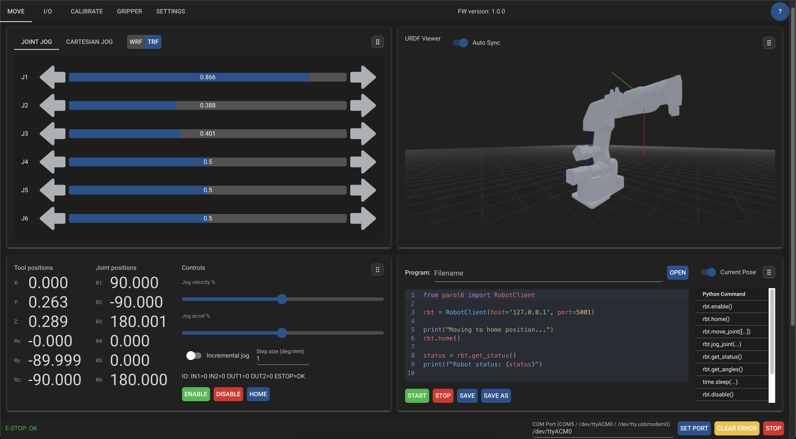

# PAROL Web Commander

A modern web interface for controlling the PAROL6 desktop robotic arm. This app provides a NiceGUI-based UI for jogging, monitoring I/O, running programs, and 3D visualization over the UDP-based PAROL6 headless controller.

This project integrates:
- Hardware: PAROL6 robot and control board
- Server: Headless controller from the PAROL6 Python API (UDP on port 5001 by default)
- Client: Async UDP client embedded in this web app
- UI: NiceGUI web frontend with live status and controls

Upstream projects and docs:
- PAROL6 hardware: https://github.com/PCrnjak/PAROL6-Desktop-robot-arm
- Commander software (GUI + docs): https://github.com/PCrnjak/PAROL-commander-software
- Python API (headless + UDP client): https://github.com/PCrnjak/PAROL6-python-API
- Official docs: https://source-robotics.github.io/PAROL-docs/

Note: To run a real robot, you must have a PAROL6 control board: https://source-robotics.com/products/parol6-control-board



## Features

- Live robot telemetry (joint angles, Cartesian pose, I/O, gripper data)
- Joint and Cartesian jogging with keyboard shortcuts (WASD + Q/E)
- Digital I/O control and status
- SSG-48 electric gripper control
- Multi-tab program editor and runner (Python) with streamed console output
- Command palette with auto-complete from robot client API
- Path preview with dry-run simulation and per-pose IK validity
- Motion recording (manual, continuous, and post-jog modes)
- URDF 3D viewer with live joint visualization and interactive gizmo
- Stepping/debug mode for script execution
- Theme switching (light/dark/system)
- E-stop status display and keyboard shortcut

## How it fits together

- Headless controller (server)
  - Runs on the machine connected to the robot over USB/Serial
  - Listens for UDP commands on port 5001 (default)
  - Provided by the PAROL6 Python API (`parol6.server.controller`)
- Web app (client + UI)
  - This repository runs a NiceGUI server
  - Renders control pages and sends commands via `parol6.AsyncRobotClient`
  - Manages the controller process via `parol6.Robot`, which handles lifecycle (start/stop) internally
- Networking
  - Default controller target is `127.0.0.1:5001`
  - Status is pushed via UDP multicast (239.255.0.101:50510) — no polling
  - Can be reconfigured to a remote controller via environment variables (see Configuration)

### Robot backends

The web commander communicates with robot hardware through a backend that satisfies the `Robot` ABC defined in the [`waldoctl`](https://github.com/Jepson2k/waldoctl) package. The default (and currently only) backend is [PAROL6 Python API](https://github.com/Jepson2k/PAROL6-python-API), installed as an optional dependency (`pip install parol-commander[parol6]`). Other backends can be used as long as they extend the same base classes.

## Requirements

- Minimum/validated baseline: Raspberry Pi 5. This app and the headless controller are designed and frequently tested to sustain 100 Hz+ control loops on an RPi 5.
- Other supported platforms: x86_64 Linux, macOS, and Windows are supported for both the UI and the headless controller as long as timing targets and serial/USB requirements are met (performance depends on your CPU and OS).
- OS:
  - Controller: 64-bit Linux recommended (e.g., Raspberry Pi OS 64-bit Bookworm). Other OSes can work if they meet timing targets.
  - UI: Any modern OS with Python 3.12+.
- Python: 3.12+
- Hardware: PAROL6 robot with PAROL6 control board connected via USB
- Notes:
  - Ensure your user has permission to access the serial device (e.g., add to the `dialout` group or set udev rules on Linux).
  - If running on lower-performance hardware, consider reducing polling rates and/or running the UI and controller on the same machine.

## Quick start (local controller + UI on the same PC)

1) Clone:
```bash
git clone https://github.com/Jepson2k/PAROL-Web-Commander.git
cd PAROL-Web-Commander
```

2) Create and activate a virtual environment (examples):

macOS/Linux:
```bash
python3.12 -m venv .venv
source .venv/bin/activate
```

Windows (PowerShell):
```powershell
py -3.12 -m venv .venv
. .\.venv\Scripts\Activate.ps1
```

3) Install with the PAROL6 backend:
```bash
pip install -e ".[parol6]"
```

4) Connect the robot via USB. Identify the port (examples):
- Windows: `COM5`
- Linux: `/dev/ttyACM0`
- macOS: `/dev/tty.usbmodemXXXX`

5) Run the web UI:
```bash
parol-commander
```
Open the printed URL in your browser.

6) In the Settings panel, set the serial port and click "Set Port". On launch the app will, by default, auto-start the headless controller (configurable via `PAROL_AUTO_START=0`). The Set Port action stores the value in local storage and sends it to the controller.

### CLI Options

```bash
parol-commander [options]
```

Options:
- `--host HOST`: Webserver bind host (default: `0.0.0.0`)
- `--port PORT`: Webserver bind port (default: `8080`)
- `--controller-host HOST`: Controller host to connect to (default: `127.0.0.1`)
- `--controller-port PORT`: Controller UDP port (default: `5001`)
- `--log-level LEVEL`: Set log level (TRACE, DEBUG, INFO, WARNING, ERROR, CRITICAL)
- `-v`, `-vv`: Increase verbosity (INFO / DEBUG)
- `-q`: Enable WARNING logging
- `--reload`: Enable auto-reload on file changes (dev mode)

Examples:
```bash
# Custom ports and more verbose logging
parol-commander --port 8081 --controller-port 5002 -vv

# Disable auto-start via environment variable
PAROL_AUTO_START=0 parol-commander
```

## Configuration

Environment variables (read in `parol_commander/constants.py` and at runtime):

- `PAROL_CONTROLLER_IP`: Controller host (default: `127.0.0.1`)
- `PAROL_CONTROLLER_PORT`: Controller UDP port (default: `5001`)
- `PAROL_SERVER_IP`: NiceGUI bind host (default: `0.0.0.0`)
- `PAROL_SERVER_PORT`: NiceGUI HTTP port (default: `8080`)
- `PAROL_AUTO_START`: Enable automatic controller start on app launch (default: `1`; set to `0` to disable)
- `PAROL_LOG_LEVEL`: `DEBUG` | `INFO` | `WARNING` | `ERROR` | `CRITICAL` (default: `WARNING`)
- `PAROL_WEBAPP_CONTROL_RATE_HZ`: Jog emission cadence from UI to controller (default: `20`)
- `PAROL_WEBAPP_AUTO_SIMULATOR`: If no serial port is configured, auto-enable simulator on startup (default: `1`)
- `PAROL_WEBAPP_REQUIRE_READY`: Wait for server ready and enable stream_on at startup (default: `1`)
- `PAROL_TRACE`: Enable TRACE-level logging in console/UI logs (`1` / `true` / `yes` / `on`)

Examples (macOS/Linux):
```bash
export PAROL_CONTROLLER_IP=127.0.0.1
export PAROL_CONTROLLER_PORT=5001
export PAROL_SERVER_IP=0.0.0.0
export PAROL_SERVER_PORT=8080
export PAROL_LOG_LEVEL=INFO
export PAROL_AUTO_START=1
```

Notes:
- The UI persists the last-used COM port in its local storage; you can also set it from the Settings panel.
- The app uses `parol6.Robot` to manage the headless controller process and `parol6.AsyncRobotClient` to send commands and receive status.

## Remote controller scenario (advanced)

If your headless controller runs on a different machine:

1. Start the controller there using the PAROL6 Python API.
2. Ensure UDP port 5001 is open on the controller host.
3. Run this web app on any machine and set:
   - `PAROL_CONTROLLER_IP` to the controller's IP (e.g. `192.168.1.100`)
   - `PAROL_CONTROLLER_PORT` as needed (default `5001`)

For best results and fewer timing issues, run the web app and controller on the same machine connected to the robot.

## Program editor

The Program tab includes a multi-tab code editor and runner:
- **Multi-tab editing**: Create, open, and save multiple Python scripts. Each tab tracks unsaved changes and maintains its own simulation results.
- **Default template**: Uses `parol6.RobotClient` and is prefilled with the current controller host/port.
- **Execution**: "Start" spawns a Python subprocess and streams stdout/stderr into the UI log. "Stop" requests a graceful termination and force-kills on timeout if needed.
- **Stepping mode**: Execute scripts one command at a time with state inspection after each step.
- **Command palette**: Auto-complete suggestions generated from `AsyncRobotClient` methods with signatures and docstrings, organized by category.
- **Path preview**: Dry-run simulation shows motion paths in the 3D viewer with per-pose IK validity (green/yellow/red) and estimated duration before running on hardware.
- **Motion recording**: Record robot movements as Python code in three modes:
  - *Manual*: Click to capture the current pose
  - *Continuous*: Record positions at fixed intervals during motion
  - *Post-jog*: Auto-capture endpoints after jogging completes
- Scripts are saved under `./programs` by default (directory is created if missing).
- "Open" supports uploading text-based programs into the editor.

## 3D visualization

The URDF viewer provides live visualization of the robot:
- **Live joint tracking**: Joint angles update in real-time from robot telemetry.
- **Interactive gizmo**: Drag the TCP gizmo to manually position the robot end-effector.
- **Target placement**: Click in 3D space to place motion targets, or use the target editor for precise XYZ + RPY input.
- **Path rendering**: Simulated motion paths are rendered with color-coded IK validity and direction arrows.
- **Workspace envelope**: Optional visualization of the robot's reachable workspace.
- **Theme aware**: Automatically adapts to light/dark theme selection.

## Keyboard shortcuts

| Key | Action | Category |
|-----|--------|----------|
| **H** | Home robot | Robot Control |
| **Esc** | Emergency Stop | Robot Control |
| **Space** | Play/Pause | Playback |
| **S** | Step forward (while running) | Playback |
| **W/S** | Jog Y+/Y- | Cartesian Jog |
| **A/D** | Jog X-/X+ | Cartesian Jog |
| **Q/E** | Jog Z-/Z+ | Cartesian Jog |
| **[/]** | Decrease/Increase jog speed | Speed Control |
| **T** | Add target at current position | Recording |

Jog keys support click-vs-hold: a quick press sends a single step; holding the key jogs continuously.

## Settings

Accessible from the gear icon in the UI:
- **Serial port**: Auto-detected from available ports, or enter manually
- **Theme**: Light, Dark, or System
- **Motion profile**: TOPPRA (default), RUCKIG, QUINTIC, TRAPEZOID, LINEAR
- **Envelope visualization**: Auto, On, or Off

## Connection status

The UI shows live connection indicators:
- **CTRL**: Controller process status (green = running, red = stopped)
- **ROBOT**: Hardware connection (green = connected, grey = simulator active)

## Control rates

Jog emission cadence is governed by `PAROL_WEBAPP_CONTROL_RATE_HZ` (default 20 Hz). The UI uses timers to send joint/Cartesian jog updates and will log warnings if measured cadence drift exceeds a small tolerance.

## Development and tests

Install dev extras:
```bash
pip install -e .[dev]
```

Run linters and tests:
```bash
ruff check .
mypy .
pytest
```

Test configuration/env notes:
- Integration tests spawn the headless server with fake serial — all configured automatically in `conftest.py`.
- Do **not** prefix `pytest` with environment variables; everything is set in `conftest.py`.

Project config:
- `pyproject.toml` configures `pytest`, `ruff`, and `mypy`.
- Pre-commit hooks are defined in `.pre-commit-config.yaml`.

## Safety and liability

- Always have physical E-Stop accessible. Keep work area clear.
- Software safeguards are not a substitute for safe operating practice. Use at your own risk.

## Credits and licensing

- Hardware: PAROL6 by Source Robotics (see upstream repos)
- Software: This UI builds on the open-source PAROL6 ecosystem:
  - PAROL6-Desktop-robot-arm
  - PAROL-commander-software
  - PAROL6-python-API
- Licensing follows the terms of the upstream components; see LICENSE files in those repositories.
