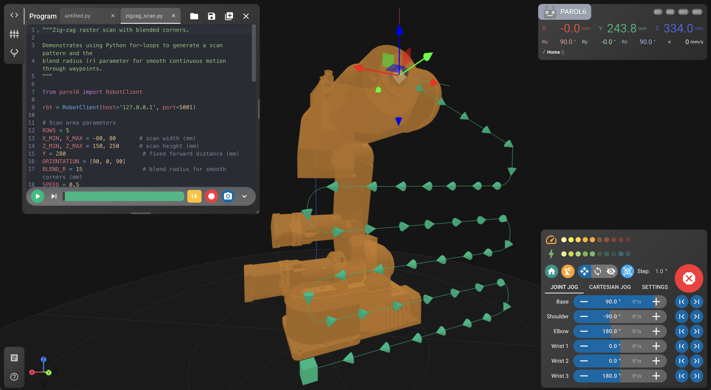

# Waldo Commander

A web interface for controlling robotic arms, currently tested with the [PAROL6](https://github.com/PCrnjak/PAROL6-Desktop-robot-arm) robot.



- **Browser-based.** Control from any device on the network without being tethered to the arm.
- **Python programs.** Write robot programs in Python with loops, math, and libraries. Built-in editor with auto-complete, live output, and step-through debugging.
- **3D simulation.** Preview motion paths, check reachability, and scrub through the timeline — no physical robot needed.
- **Teach by demonstration.** Control the robot live and record the motions as Python code.
- **Backend-agnostic.** Robot-specific logic lives behind the [waldoctl](https://github.com/Jepson2k/waldoctl) abstraction layer. Other robots can be integrated by implementing the same interfaces — see the [Backend Development Guide](https://jepson2k.github.io/PAROL-Web-Commander/guides/backend-development/).

## Quick start

```bash
git clone https://github.com/Jepson2k/PAROL-Web-Commander.git
cd PAROL-Web-Commander
pip install -e ".[parol6]"
waldo-commander
```

Open the printed URL. No robot connected? The app auto-starts in simulator mode so you can explore.

For connecting hardware, platform-specific setup, and configuration, see [Getting Started](https://jepson2k.github.io/PAROL-Web-Commander/getting-started/).

## Links

- [Documentation](https://jepson2k.github.io/PAROL-Web-Commander/)
- [waldoctl](https://github.com/Jepson2k/waldoctl) — robot backend abstraction layer
- [PAROL6 hardware](https://github.com/PCrnjak/PAROL6-Desktop-robot-arm)

## Safety

- This software provides no safety guarantees and assumes no liability
- User accepts full responsibility for robot operation
- Simulator mode is not physics-accurate and does not guarantee repeatability on real hardware
- The digital E-STOP is not a substitute for the hardware emergency stop
- Incorrect kinematics calculations could result in sudden robotic movements
- Keep clear of all moving parts during operation

## License

See [LICENSE](LICENSE).
