# GUI review and revision

This review covers the GUI introduced by draft PRs #49–#64, together with the Settings, diagnostics, panel layout and PAR6 integration they depend on. It uses the complete stack at `6173e767` as the baseline.

The revision keeps the existing editor / 3D scene / control layout and supported dark theme. Settings stays in the control panel. Saved setup, recording and project formats and the public robot and skill APIs are unchanged.

## Findings and changes

| Area | Finding | Revision |
| --- | --- | --- |
| Settings | A 400 px panel contained 500 px wide rows. The 225 px viewport held over 2,200 px of settings and repeated help text. | Robot, Jog, View, Panels, and AI & Automation categories; short labels, help on focus/hover, collapsed details, controls that fit the panel. |
| Backend and tool selection | PAR6 could be labelled as PAROL6; Settings could show a different tool from the controller. Long PAR6 tool IDs expanded the readout. | Active backend and pending restart are distinguished. Tool selection follows controller status without issuing a selection command; observation adopts the reported TCP. Tool names have bounded width; the status strip wraps its I/O row on narrow screens so Skills cannot cover the pose readout. |
| Panels | Window resizing could leave actions below the viewport. A shared overflow rule clipped the PAR6 Drives panel. | Height and width are clamped on restore, tab changes and viewport changes. Plugin content has a working scroll container. |
| Contrast | Flat primary actions had about 2.16:1 contrast against their panel. | Flat actions now have 9.08:1 contrast against the task panel, applied in the correct NiceGUI CSS layer; opaque task panels, readable chart labels and lighter XYZ readouts. |
| Program editor | New actions left only 31 px for the file tabs at the default width. | Secondary actions live under More. The filename replaces the redundant Program heading. Execution controls stay in place. |
| Setup | Save omitted pending field edits unless Set had been pressed. Refresh reset selections. | Save includes pending edits across tabs, validates before writing, and shows unsaved state. Loading asks before discarding edits. Selections survive refresh. Resolved poses are optional details. |
| TCP and camera calibration | Measurement controls, saved values and explanations competed for space. | Concise stages and labels; measurement details can be opened when needed. Saving calibration remains separate from applying a TCP to the controller. |
| Signals | Long explanations and configuration actions crowded the mapping form. | Concise mapping fields and explicit persistence versus controller actions. |
| Skills, vision and tray workflows | Raw identifiers, repeated setup selectors and large Python previews dominated the form. | Readable names, one shared setup selector with per-argument overrides, paired short fields, concise help and a collapsed Python preview. Run once reveals the Program tab. Preview now returns a completed command index for tool selection, so generated gripper calls preview successfully. |
| Demonstrations | Raw sample indexes were the primary range controls; the chart was cramped. | Range selection in seconds with optional sample indexes, a larger plot, joint legend controls and an expanded chart. Original observations, absolute angles and gaps are preserved. |
| Torque and gripper graphs | Small plots, faint labels, missing time axes and no easy expanded view. | Shared palette, units, time labels, tooltips and expansion. Torque starts with measured data and provides source and joint focus controls. Gripper data is drawn without artificial smoothing. The expanded chart uses independent options and live data updates without redundant redraws. |
| Run records | Nested dialogs exposed large JSON records before useful values; Refresh did not discover new runs. | Inline arguments/results, optional raw JSON, compact pagination, a scrolling body with fixed actions, and refreshed run choices. |
| Restart and projects | Raw runtime IDs, requirements and long instructions crowded common actions. | Controller and package details are collapsed; primary actions are distinct; archive inspection/import/open remain explicit steps. |
| PAR6 scene | A sphere in the packaged tool URDF crashed an STL-only visual loader. | URDF meshes, spheres, boxes and cylinders render with their transforms and collision-link tracking. |
| Physics overlays | Tiny translucent legend text overlapped the corner axes. | Opaque legend, readable captions and clearance above the axes. |

PR #61 adds CLI/Python simulation scenarios; this revision does not invent a separate scenario editor.

## Verification

Verification uses the PAROL6 fake-serial controller and a real `par6d --sim` process with matching PAR6 bindings/configuration. Camera image fixtures are used where a camera is needed. No physical robot is exercised.

Browser layout coverage uses actual CSS viewports of 1920×1080, 1366×900, 1366×768 and the equivalent of 125% browser zoom at 1366×768. It checks Settings overflow, action visibility, filename space, rendered button colors, and controller/tool agreement. PAR6 additionally exercises the torque view, expanded graph and Drives scrolling.

Local verification uses Python 3.13 and Chromium 148 on Linux ARM64. The backend sources match the draft stack: waldoctl `0b88b501`, PAROL6 `ca62e2fb`, PAR6 `ccd386a0`, and pinned NiceGUI `be1d73b5`. Matching `fix/gui-review` branches point to these unchanged backend commits for CI.

### Completed checks

| Coverage | Passed |
| --- | ---: |
| PAROL6 functional workflows | 38 |
| PAROL6 browser layout and populated workflows | 9 |
| Native PAR6 runtime workflows and cancellation | 3 |
| Native PAR6 browser layout, torque and Drives | 1 |
| **Total** | **51** |

Results combine sequential targeted runs. Failures were corrected and the affected checks rerun; the [case-by-case record](validation.json) identifies the applicable report for each test. Both four-viewport layout matrices pass. The recording browser test also saves a range selected in seconds and compares its timestamps and joint values with the original observed samples.

The setup draft regression test was run against the original stack: saving a changed frame and pose returned `(11, 2, 3)` instead of `(21, 2, 8)`. The same test passes on the revision and checks that an invalid field cannot cause a partial save.

The tool-selection preview regression was also exercised before the fix: the preview returned `None` where the generated gripper call requires a command index. The collector now records immediate completion for a successful tool selection.

Type checking (`ty 0.0.73` with the stack dependencies), Python undefined-name/syntax checks and JavaScript syntax checks pass. The broader local Ruff profile has pre-existing findings in the stack; this revision introduces none. The full cross-platform CI suite is separate from the local checks below.

## Screenshots

Screenshots are unedited captures of the running application. PAROL6 uses fake serial; PAR6 uses its native simulator. The native debug runtime reports a control-loop load warning on this ARM host, which remains visible in the captures.

### Settings and smaller screens

[Original Settings](before-parol6-settings.png) and [original PAR6 editor](before-par6-editor.png) show the width and toolbar regressions.

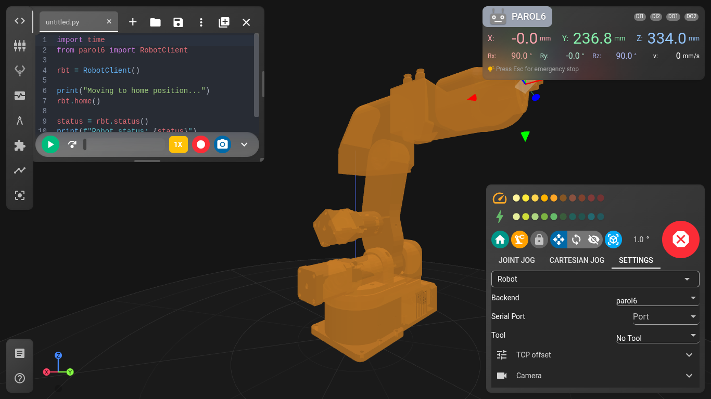

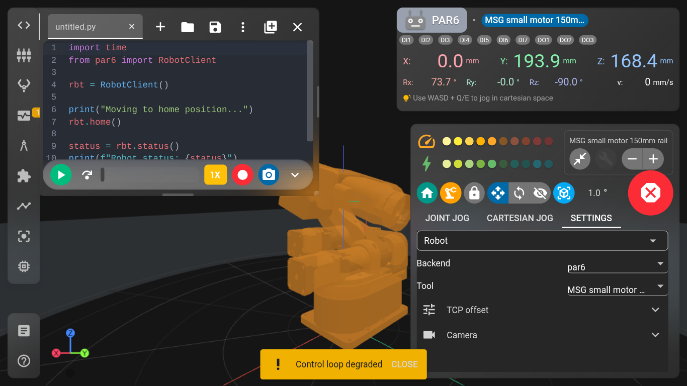

### Skills and calibration

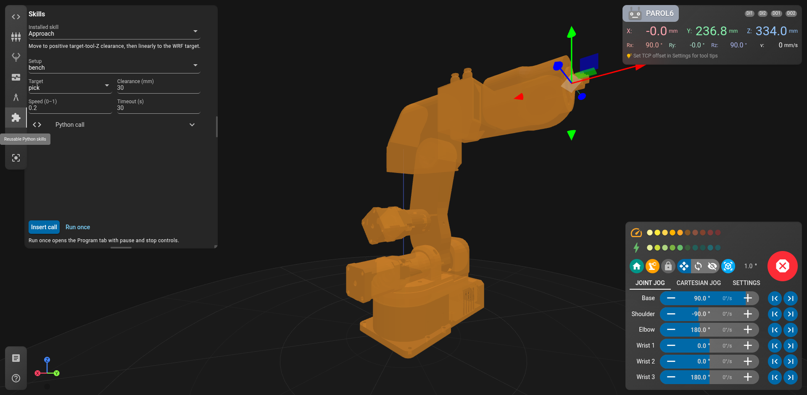

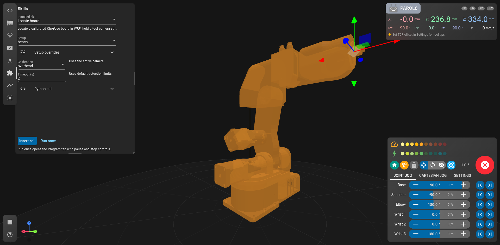

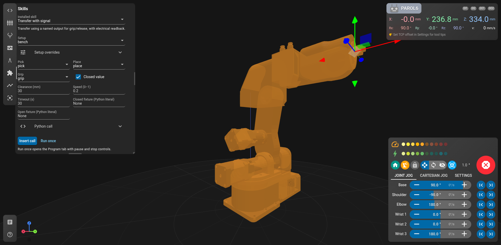

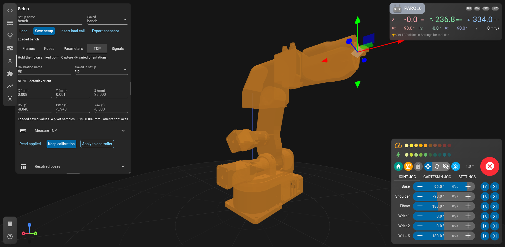

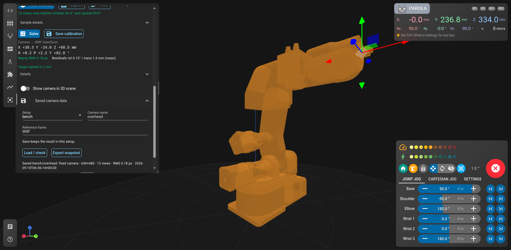

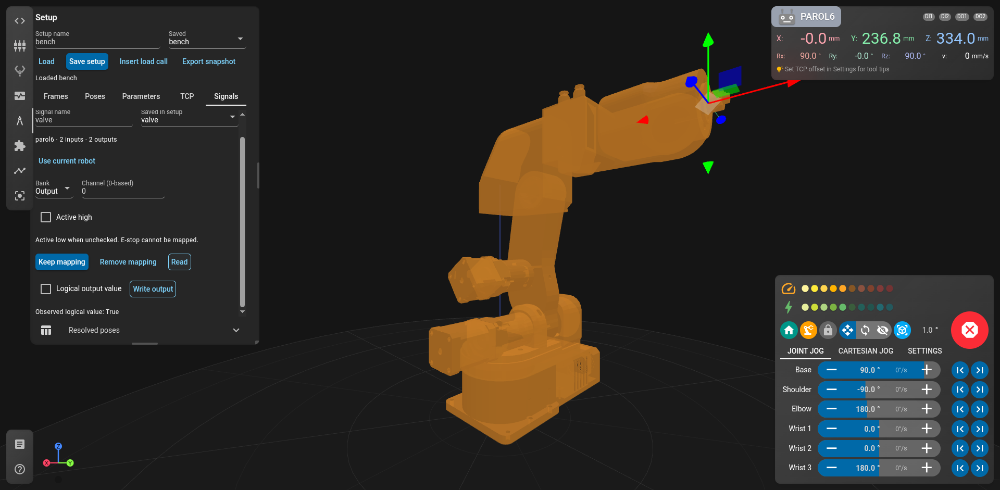

### Graphs and review dialogs

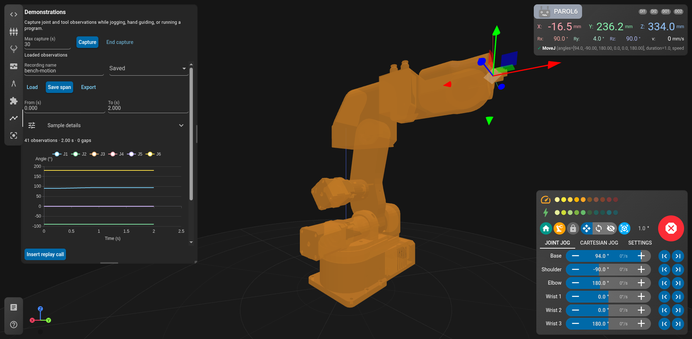

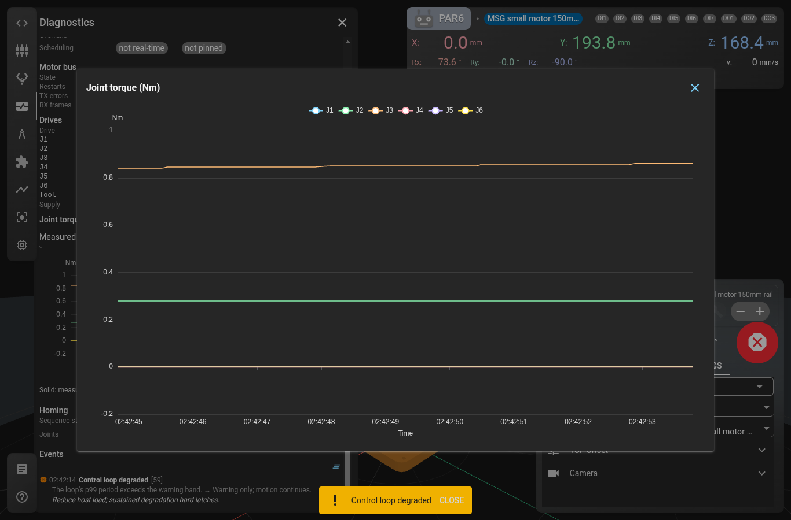

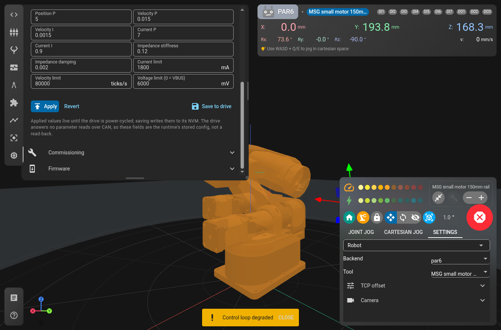

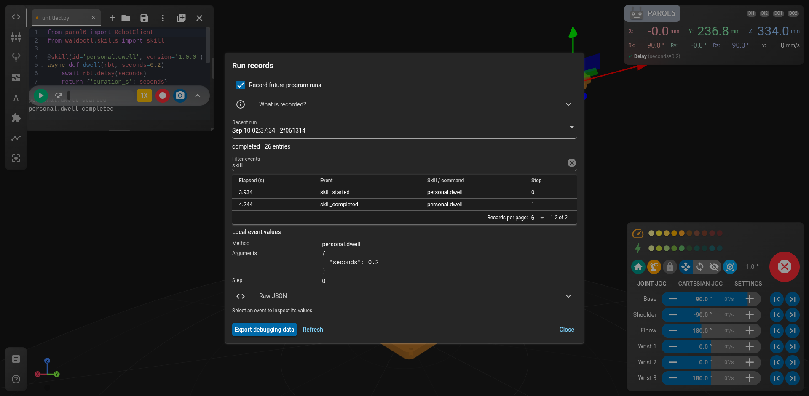

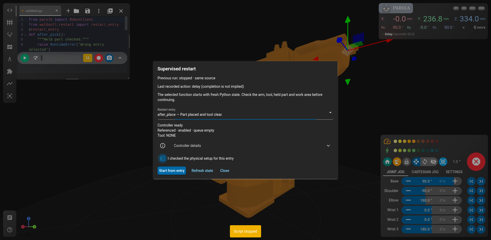

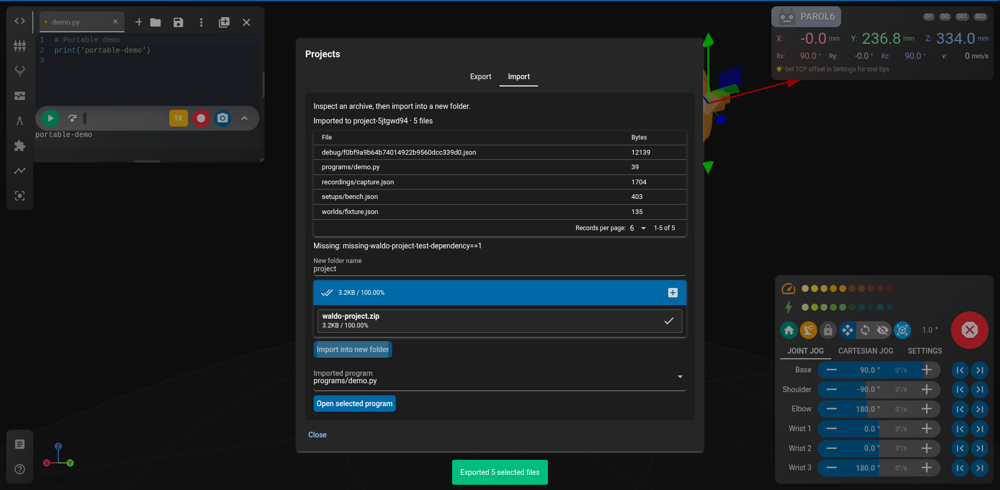

