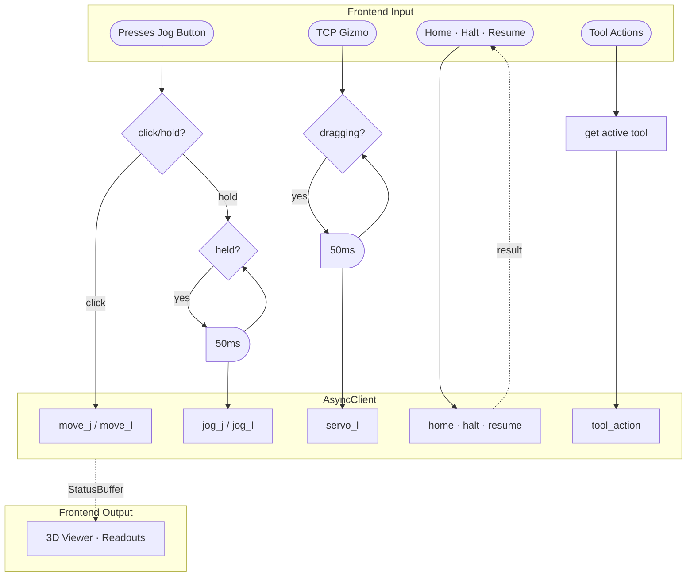
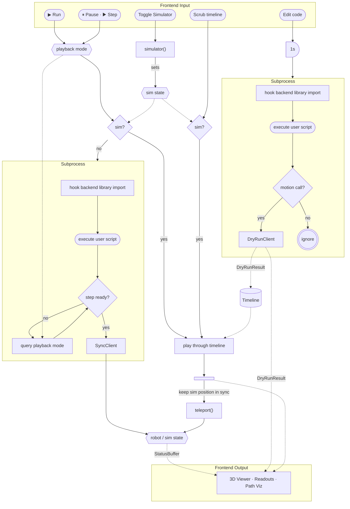

# Backend Development Guide

This guide walks through integrating a new robot backend with Waldo Commander. By the end, your robot will appear in the 3D viewer, respond to jog commands, run user scripts, and preview motion paths.

## What is waldoctl?

[waldoctl](https://github.com/Jepson2k/waldoctl) is a small Python package that defines the abstract interfaces your backend implements. It contains no robot-specific logic -- just ABCs, Protocols, and type definitions. Install it as a dependency of your backend package:

```
pip install waldoctl
```

This guide explains the concepts and patterns. For exact method signatures, default values, and parameter semantics, refer to waldoctl's source docstrings.

## Architecture overview

Waldo Commander interacts with your backend through three client interfaces. The diagrams below split this into two flows: **live control** (direct, real-time user interaction) and **script execution** (recorded path preview, script run, and timeline scrubbing). Both can target either the real robot or the simulator -- the difference is whether commands originate from a live user action or a script being executed.

### Interactive control



The UI creates an `AsyncRobotClient` at startup. This client serves two purposes: streaming status telemetry back to the UI, and sending control commands.

**Status streaming** -- `stream_status_shared()` is an async iterator that yields `StatusBuffer` snapshots. It drives the entire UI: joint angle readouts, 3D viewer pose, TCP speed, I/O state, gripper position, action state, and simulator status. The buffer is a Protocol with numpy array fields for zero-copy access. You fill these arrays in your backend's status loop and yield the same buffer object each iteration.

**Jogging** -- When the user holds a jog button, the UI sends `jog_j` or `jog_l` commands at 20 Hz, each with a 0.1-second duration. Your backend should blend consecutive commands into smooth motion -- don't queue stale ones. When the user clicks (rather than holds) a jog button, the UI sends a single `move_j` or `move_l` step instead.

**Gizmo drag** -- When the user drags the TCP gizmo in the 3D viewer, the UI sends `servo_l` position targets at 20 Hz. Your backend should replace stale targets rather than enqueuing them.

**Single commands** -- `home`, `halt`, `resume`, `move_j`, `move_l` are one-off commands triggered by UI buttons. `halt` must stop motion immediately.

### Script execution


User programs are plain Python files that import your backend's client directly:

```python
from mybackend import RobotClient

rbt = RobotClient(host='127.0.0.1', port=5001)
rbt.home()
rbt.move_j(pose=[100, 200, 300, 0, 0, 0], speed=0.5)
```

The same script works in three contexts without modification:

- **Standalone** -- the script connects to the real backend and executes on hardware or simulator.
- **In Waldo Commander (run)** -- Commander hooks the import to wrap your client with stepping support (pause/step/play for debugging). Commands still flow to the real backend.
- **In Waldo Commander (path preview)** -- When the user edits code in the editor, Commander debounces for 1 second of idle time, then runs the script in an isolated subprocess with your `DryRunClient` substituted for the real client. The script runs identically -- loops, conditionals, math all work -- but each motion call returns trajectory data instead of executing normally. Results feed the path visualizer and populate the timeline. In **simulator mode**, the timeline slider is interactive -- the user can scrub freely and play at variable speeds. Commander sends `teleport` commands in parallel to keep the backend's simulator state in sync. After playback stops, the simulator knows where the robot "is" and subsequent operations start from the correct position. During teleport playback, Commander suppresses real-time status updates to the 3D viewer to prevent jitter.

The backend author doesn't need to do anything special for this. Commander handles the hooking; your client just needs to work as a normal Python class.

## What you implement

Your backend is a Python package that provides:

1. A `Robot` subclass -- configuration and kinematics
2. A `RobotClient` subclass -- control interface (async and sync)
3. A `DryRunClient` (optional) -- trajectory preview
4. Tool definitions -- end-effector configuration

### Robot subclass

The `Robot` ABC is the central configuration object. It tells Waldo Commander everything about your robot's geometry, capabilities, and how to create clients.

#### Identity and units

The `name` property is a display string. `position_unit` (`"mm"` or `"m"`) tells the UI how your users think about distance -- it affects readout formatting but not internal math (which is always meters + radians). This enables users of small robots to use millimeters and users of large robots to use meters.

#### Joint configuration

The `joints` property returns a `JointsSpec` containing:

- `count` -- number of actuated joints
- `names` -- display names for each joint
- `limits` -- position limits (degrees and radians), plus kinodynamic limits (velocity, acceleration, jerk) for both hardware maximums and reduced jog-mode limits
- `home` -- the home/standby position in degrees and radians

You construct `JointsSpec` once in `__init__` -- see the [minimal skeleton](#minimal-skeleton) for an example.

#### Kinematics

You implement `fk` and `ik` for forward and inverse kinematics:

- `fk(q_rad, out)` -- takes joint angles in radians and a pre-allocated output buffer, returns `[x, y, z, rx, ry, rz]` in meters + radians. The buffer is reused to avoid allocations in the hot path.
- `ik(pose, q_seed_rad)` -- takes a pose and seed angles, returns an `IKResult` with the solution in radians, a success flag, and optional violation descriptions.
- `fk_batch` and `ik_batch` -- used for path preview, same semantics on arrays of poses.

If you already have an IK library (KDL, ikfast, Pinocchio, or your SDK's built-in solver), you just wrap it here.

#### Lifecycle

`start` initializes the backend (spawn a subprocess, connect to a server, launch a ROS node -- whatever applies). `stop` tears it down. `is_available` is a quick health check.

#### Client factories

`create_async_client` and `create_sync_client` construct connected clients. `create_dry_run_client` returns a `DryRunClient` or `None` if you don't support trajectory preview.

### RobotClient (async and sync)

The `RobotClient` ABC defines the control interface. Your backend provides two variants -- async and sync -- that expose the same methods with the same behavior. The only difference is Python calling convention: `async`/`await` vs blocking calls.

How you implement them is up to you. You can write the async client first and wrap it to get the sync version (the approach PAROL6 takes), or vice versa, or implement both independently. waldoctl doesn't prescribe the relationship.

Your `Robot` must expose `sync_client_class` and `async_client_class` properties so the editor can discover available commands for autocomplete.

The client's methods fall into several patterns:

**Trajectory-planned motion** -- `move_j`, `move_l`, and `home` are the core commands. The backend plans the full trajectory and executes it. Each returns a command index that can be passed to `wait_command`. Optional extensions (`move_c`, `move_s`, `move_p`) have ABC defaults that raise `NotImplementedError`. Waldo Commander itself doesn't expose UI controls for these moves today, but user scripts can call them and will get the standard exception if your backend hasn't implemented them.

**Streaming position** -- `servo_j` and `servo_l` are fire-and-forget position targets. The UI uses these for gizmo drag at 20 Hz. Consume each target immediately and blend or interpolate to the next one. Don't queue them.

**Streaming velocity** -- `jog_j` and `jog_l` are velocity-mode jog commands with a duration parameter. Each says "move at this speed for this long." The UI sends a new one every 50 ms; if it stops sending, the robot stops after the duration expires.

**Status streaming** -- `stream_status_shared` yields `StatusBuffer` snapshots driving the entire UI. See [Interactive control](#interactive-control) above.

**Optional methods** -- Many `RobotClient` methods have ABC defaults that raise `NotImplementedError`. Waldo Commander does **not** introspect your client to disable controls automatically -- if a user script calls an unimplemented method, it will raise at runtime. Document which optional features your backend supports so users know what to expect.

### Simulator mode

Your client implements `simulator(enabled)` and `is_simulator()` to toggle and query simulator mode. When simulator mode is on, the backend simulates robot behavior without hardware -- how you do this is entirely up to you. The PAROL6 backend swaps its serial transport for a very basic simulation; another backend might do something completely different.

The important contract is:

- Status streaming, motion planning, and command execution all work normally in simulator mode
- `StatusBuffer.simulator_active` reflects the current mode in every status update
- `teleport(angles, tool_positions)` is available for instant position jumps without trajectory planning (simulator only)

Commander uses teleport during simulation playback to keep the backend's state synchronized with the timeline animation.

### DryRunClient (optional)

The `DryRunClient` Protocol enables trajectory preview. It mirrors a subset of the real client's motion commands (`move_j`, `move_l`, `home`) -- each call returns a `DryRunResult` describing the trajectory the motion would produce:

- `tcp_poses` -- the TCP trajectory as an array of `[x, y, z, rx, ry, rz]` poses
- `joint_trajectory_rad` -- the full joint trajectory (enables simulation playback with timeline scrubbing)
- `duration` -- estimated trajectory duration
- `valid` -- per-pose IK validity (enables reachability coloring in the 3D viewer)
- `error` -- diagnostic when a motion fails in simulation

`flush()` returns a list of all accumulated `DryRunResult` objects since the last flush, which handles motions still in a blend buffer.

### Tool configuration

Tools are end-effectors: grippers, spindles, vacuum cups, bare flanges. The `tools` property on your `Robot` returns a `ToolsSpec` -- a collection of `ToolSpec` objects describing your available tools.

#### Tool types and UI generation

`ToolType` determines what UI panel appears:

- `ToolType.NONE` -- passive tool. TCP offset and 3D visual only, no control panel. Every robot needs at least one.
- `ToolType.GRIPPER` -- gets a dedicated control panel with position slider, status indicators, and real-time data charts.

Beyond the panel, any tool can have automatic action buttons in the UI. Setting `action_l_labels`, `action_l_icons`, and `action_l_mode` on your `ToolSpec` generates a toggle or trigger button on the left side. Same for `action_r_*` on the right. `adjust_step`, `adjust_labels`, and `adjust_icons` add +/- adjust buttons. The UI generates these controls from your ToolSpec properties -- you don't need a gripper to get tool controls.

#### Gripper subtypes

Currently, grippers get the most extensive UI support. Two subtypes:

- `PneumaticGripperTool` -- binary open/close via a digital I/O port. `ActivationType.BINARY` means no position feedback from hardware; motion descriptors need `estimated_speed` fields so the viewer can animate transitions.
- `ElectricGripperTool` -- continuous position control with speed and current parameters. `ActivationType.PROGRESSIVE` means real-time position feedback. Real-time charts plot position and current channels over time. `channel_descriptors` define the data channels (e.g., "Current" in mA).

Both support `open()`, `close()`, and `set_position()` (normalized 0.0 = fully open, 1.0 = fully closed).

#### Tool geometry

Each tool declares:

- `tcp_origin` / `tcp_rpy` -- TCP offset from the flange, applied to FK/IK
- `meshes` -- tuple of `MeshSpec` entries, each with a filename, origin offset, orientation, and role (`BODY`, `JAW`, or `SPINDLE`)
- `motions` -- `LinearMotion` or `RotaryMotion` descriptors that tell the viewer how to animate moving parts based on the tool status positions
- `variants` -- named configurations (e.g., different jaw sets) that swap meshes and motions wholesale. A variant selector appears in the UI when variants are defined.

#### Tool actions and status

Tools dispatch actions through callbacks bound at client creation time. When user code calls `rbt.tool.close()`, it routes through `client.tool_action()` to your backend. Your backend executes the action and reports results via `ToolStatus` in the status stream:

- `state` -- OFF, IDLE, ACTIVE, ERROR
- `engaged` -- actively doing work
- `part_detected` -- object presence confirmed
- `positions` -- DOF positions (one per motion descriptor), normalized 0..1
- `channels` -- process data (e.g., current in mA), described by `channel_descriptors`
- `fault_code` -- 0 = no fault

## Registration

Backends register themselves via a Python entry point in the `waldoctl.robots` group -- no edits to Waldo Commander are required. Add the entry point to your backend's `pyproject.toml`:

```toml
[project.entry-points."waldoctl.robots"]
my_robot = "my_robot.robot:Robot"
```

The entry-point value must point to a `waldoctl.Robot` subclass. Once the package is installed in the same environment as Waldo Commander, the backend is automatically discovered by `waldoctl.discovery.available_backends()` and selectable from the UI.

**Selecting a backend** -- if multiple backends are installed, choose one by setting the `WALDO_ROBOT` environment variable to the entry-point name. With a single backend installed, it is auto-selected. Otherwise Waldo Commander falls back to its built-in default (`parol6`).

## Visualization

The 3D viewer renders your robot from a URDF file. Your `Robot` must provide:

- `urdf_path` -- absolute path to the URDF file
- `mesh_dir` -- absolute path to the directory containing STL meshes referenced by the URDF
- `joint_index_mapping` -- a tuple that maps URDF joint indices to your control joint order

The joint index mapping matters when the URDF's link/joint ordering differs from your control joint numbering. For example, if URDF joint 0 corresponds to your control joint 2, the mapping handles the translation so the 3D model moves correctly.

Tool meshes are defined in your `ToolSpec` via `MeshSpec` entries. Each mesh has a filename, origin offset, orientation, and a role (body, jaw, spindle). Motion descriptors (`LinearMotion`, `RotaryMotion`) tell the viewer how to animate moving parts based on the tool status positions reported in `StatusBuffer.tool_status`.

## Frontend integration details

These aren't enforced by waldoctl, but they matter for a good user experience.

### Feature activation

The UI conditionally renders some panels based on what your `Robot` reports:

- `digital_inputs` / `digital_outputs` counts -- the I/O panel renders exactly that many input/output rows.
- `ToolsSpec.available` -- when the active tool is a `GripperTool`, the gripper tab is enabled and its panel is built.
- `create_dry_run_client()` returning `None` -- path preview silently produces no segments. The editor still accepts code edits; the preview just doesn't render.

The following `Robot` properties exist in the `waldoctl` ABC but are **not currently consumed by the UI**: `has_freedrive`, `has_force_torque`. Setting them has no effect today.

### Status update rate

The 3D viewer interpolates joint angles at the browser's frame rate, but the source data comes from `stream_status_shared`. At 10 Hz the robot looks jerky; 50-100 Hz gives smooth real-time rendering. Consider the tradeoff with network bandwidth and CPU load on your controller.

### Command palette

`RobotClient` methods that include `Category:` and `Example:` sections in their docstrings appear in the editor's auto-complete palette. Follow this format in your client's docstrings to get easy editor integration:

```python
async def move_j(self, target, *, speed=0.0, **kwargs):
    """Joint-space move.

    Category: Motion

    Example:
        rbt.move_j([0, -90, 0, 0, 0, 0], speed=0.5)
    """
```

### DryRunResult fields

The `DryRunResult` Protocol splits its fields into required and optional:

**Required** (must always be set):

- `tcp_poses` -- the TCP trajectory rendered as the 3D path
- `end_joints_rad` -- final joint angles after the motion
- `duration` -- estimated trajectory duration; `0.0` is valid for instant motions like teleport or home

**Optional** (set to `None` to skip the corresponding feature):

- `joint_trajectory_rad` -- full joint trajectory; required to enable timeline scrubbing playback
- `valid` -- per-pose IK validity flags; enables green/red reachability coloring in the 3D viewer
- `error` -- diagnostic shown when a motion fails in simulation

## Minimal skeleton

This is a starting structure with all required abstract methods stubbed. It compiles and gives you a scaffold to fill in:

```python
"""Minimal robot backend skeleton."""

from __future__ import annotations

from abc import ABC
from collections.abc import AsyncIterator
from pathlib import Path
from typing import Any, Literal

import numpy as np
from numpy.typing import NDArray

import waldoctl
from waldoctl import (
    CartesianKinodynamicLimits,
    HomePosition,
    IKResult,
    IKResultData,
    JointLimits,
    JointsSpec,
    KinodynamicLimits,
    LinearAngularLimits,
    MeshSpec,
    PingResult,
    PositionLimits,
    StatusBuffer,
    ToolSpec,
    ToolsSpec,
    ToolType,
)
from waldoctl.types import Axis, Frame

NUM_JOINTS = 6


# -- Tool configuration ----------------------------------------------------

class MyTools(ToolsSpec):
    """Bare-flange-only tool set."""

    def __init__(self) -> None:
        self._none = ToolSpec(  # type: ignore[abstract]
            key="NONE", display_name="None", tool_type=ToolType.NONE,
            tcp_origin=(0, 0, 0), tcp_rpy=(0, 0, 0),
        )

    @property
    def available(self) -> tuple[ToolSpec, ...]:
        return (self._none,)

    @property
    def default(self) -> ToolSpec:
        return self._none

    def __getitem__(self, key: str) -> ToolSpec:
        if key == "NONE":
            return self._none
        raise KeyError(key)

    def __contains__(self, item: object) -> bool:
        if isinstance(item, ToolType):
            return item == ToolType.NONE
        return item == "NONE"

    def by_type(self, tool_type: ToolType) -> tuple[ToolSpec, ...]:
        return (self._none,) if tool_type == ToolType.NONE else ()


# -- Robot ------------------------------------------------------------------

class Robot(waldoctl.Robot):
    """Minimal Robot implementation."""

    def __init__(self) -> None:
        limits = np.array([[-170, 170]] * NUM_JOINTS, dtype=np.float64)
        self._joints = JointsSpec(
            count=NUM_JOINTS,
            names=tuple(f"J{i+1}" for i in range(NUM_JOINTS)),
            limits=JointLimits(
                position=PositionLimits(deg=limits, rad=np.radians(limits)),
                hard=KinodynamicLimits(
                    velocity=np.full(NUM_JOINTS, 3.14),
                    acceleration=np.full(NUM_JOINTS, 6.28),
                ),
                jog=KinodynamicLimits(
                    velocity=np.full(NUM_JOINTS, 1.0),
                    acceleration=np.full(NUM_JOINTS, 2.0),
                ),
            ),
            home=HomePosition(
                deg=np.zeros(NUM_JOINTS),
                rad=np.zeros(NUM_JOINTS),
            ),
        )
        self._tools = MyTools()

    # -- Identity
    @property
    def name(self) -> str:
        return "MyRobot"

    @property
    def position_unit(self) -> Literal["mm", "m"]:
        return "mm"

    # -- Joint / tool / limit configuration
    @property
    def joints(self) -> JointsSpec:
        return self._joints

    @property
    def tools(self) -> ToolsSpec:
        return self._tools

    @property
    def cartesian_limits(self) -> CartesianKinodynamicLimits:
        return CartesianKinodynamicLimits(
            velocity=LinearAngularLimits(linear=0.25, angular=1.0),
            acceleration=LinearAngularLimits(linear=1.0, angular=4.0),
        )

    @property
    def digital_outputs(self) -> int:
        return 0

    @property
    def digital_inputs(self) -> int:
        return 0

    # -- Visualization
    @property
    def urdf_path(self) -> str:
        return str(Path(__file__).parent / "urdf" / "my_robot.urdf")

    @property
    def mesh_dir(self) -> str:
        return str(Path(__file__).parent / "urdf" / "meshes")

    @property
    def joint_index_mapping(self) -> tuple[int, ...]:
        return tuple(range(NUM_JOINTS))

    # -- Backend injection
    @property
    def backend_package(self) -> str:
        return "my_robot"

    @property
    def sync_client_class(self) -> type:
        return SyncClient  # defined in your package

    @property
    def async_client_class(self) -> type:
        return AsyncClient

    # -- Kinematics (replace with your actual solver)
    def fk(self, q_rad: NDArray, out: NDArray) -> NDArray:
        out[:] = 0.0  # placeholder
        return out

    def ik(self, pose: NDArray, q_seed_rad: NDArray) -> IKResult:
        return IKResultData(q=q_seed_rad.copy(), success=False, violations="not implemented")

    def fk_batch(self, joint_path_rad: NDArray) -> NDArray:
        return np.zeros((len(joint_path_rad), 6))

    def ik_batch(self, poses: NDArray, q_start_rad: NDArray) -> list[IKResult]:
        return [self.ik(p, q_start_rad) for p in poses]

    def set_active_tool(self, tool_key: str, tcp_offset_m=None, variant_key=None) -> None:
        pass  # apply tool transform to FK/IK model

    def check_limits(self, q_rad: NDArray) -> bool:
        lim = self._joints.limits.position.rad
        return bool(np.all((q_rad >= lim[:, 0]) & (q_rad <= lim[:, 1])))

    # -- Lifecycle
    def start(self, **kwargs: Any) -> None:
        pass  # connect to hardware / start subprocess

    def stop(self) -> None:
        pass

    def is_available(self, **kwargs: Any) -> bool:
        return True

    # -- Factories
    def create_async_client(self, **kwargs: Any) -> AsyncClient:
        return AsyncClient()

    def create_sync_client(self, **kwargs: Any) -> object:
        return SyncClient()


# -- AsyncRobotClient -------------------------------------------------------

class AsyncClient(waldoctl.RobotClient):
    """Minimal async client -- fill in with your SDK calls."""

    async def close(self) -> None: ...
    async def ping(self) -> PingResult | None: return PingResult(hardware_connected=False)
    async def wait_ready(self, timeout=5.0, interval=0.05) -> bool: return True

    # Status streaming
    async def status_stream(self) -> AsyncIterator[StatusBuffer]: ...  # type: ignore[override]
    async def status_stream_shared(self) -> AsyncIterator[StatusBuffer]: ...  # type: ignore[override]

    # Trajectory-planned motion
    async def move_j(self, target, **kw) -> int: return -1
    async def move_l(self, pose, **kw) -> int: return -1
    async def home(self, **kw) -> int: return -1

    # Streaming position
    async def servo_j(self, target, **kw) -> int: return -1
    async def servo_l(self, pose, **kw) -> int: return -1

    # Streaming velocity
    async def jog_j(self, joint, speed=0.0, duration=0.1, **kw) -> int: return -1
    async def jog_l(self, frame="WRF", axis=None, speed=0.0, duration=0.1, **kw) -> int: return -1

    # Synchronization
    async def wait_motion(self, timeout=10.0, **kw) -> bool: return True
    async def wait_command(self, command_index, timeout=10.0) -> bool: return True

    # Safety
    async def resume(self) -> int: return 0
    async def halt(self) -> int: return 0

    # Simulator
    async def simulator(self, enabled: bool) -> int: return 0
    async def is_simulator(self) -> bool: return True
    async def teleport(self, angles_deg, tool_positions=None) -> int: return 0

    # Queries
    async def angles(self) -> list[float] | None: return [0.0] * NUM_JOINTS
    async def pose(self, frame="WRF") -> list[float] | None: return [0.0] * 6


class SyncClient:
    """Synchronous variant -- same method names, blocking calls."""
    ...
```

## Feature-to-method mapping

This table shows which Waldo Commander features depend on which backend methods and properties. Use it to prioritize your implementation -- start with the top rows for a functional robot, then work down for richer integration.

| Feature | Required methods / properties |
|---|---|
| 3D viewer | `urdf_path`, `mesh_dir`, `joint_index_mapping`, `fk` |
| Live telemetry | `stream_status_shared` |
| Connection status | `ping` |
| E-stop / resume | `halt`, `resume` |
| Home | `home` |
| Joint jogging | `jog_j`, `servo_j` |
| Cartesian jogging | `jog_l`, `servo_l` |
| Script execution | `move_j`, `move_l`, `wait_motion` |
| Simulator mode | `simulator`, `is_simulator`, `teleport` |
| Path preview | `DryRunClient` (`move_j`, `move_l`, `home`, `flush`) |
| Simulation playback | `DryRunClient` + `joint_trajectory_rad` in `DryRunResult` + simulator mode |
| I/O panel | `digital_inputs`, `digital_outputs`, `io`, `write_io` |
| Tool action buttons | `ToolSpec` with `action_l_labels` / `action_r_labels` + `tool_action` |
| Gripper panel | `ToolsSpec` with `GripperTool` + `tool_action` |
| Gripper data charts | `ElectricGripperTool` + `channel_descriptors` + `ToolStatus.channels` |
| Command palette | `Category:` / `Example:` in method docstrings |
