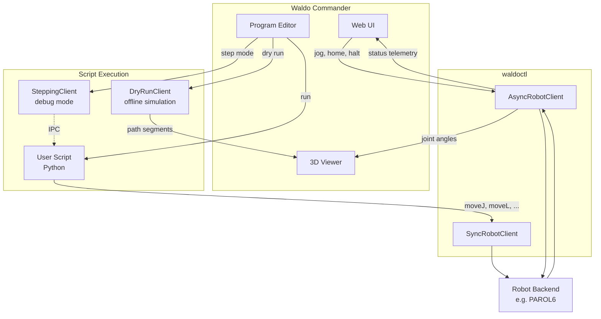

# Backend Development Guide

This guide walks through integrating a new robot backend with Waldo Commander. By the end, your robot will appear in the 3D viewer, respond to jog commands, run user scripts, and (optionally) preview motion paths offline.

## What is waldoctl?

[waldoctl](https://github.com/Jepson2k/waldoctl) is a small Python package that defines the abstract interfaces your backend implements. It contains no robot-specific logic -- just ABCs, Protocols, frozen dataclasses, and type aliases. Install it as a dependency of your backend package:

```
pip install waldoctl
```

This guide explains the concepts and patterns. For exact method signatures, default values, and parameter semantics, refer to waldoctl's source docstrings.

## Architecture overview



There are three data paths between Waldo Commander and your backend:

**Interactive control** -- The web UI creates an `AsyncRobotClient` for real-time operations: jogging, homing, e-stop, tool actions. The same client streams status telemetry back to the UI at 20-100 Hz, driving the joint readouts, 3D viewer, I/O panel, and gripper display.

**Script execution** -- User programs are plain Python files that run in a subprocess. They use a `SyncRobotClient` (synchronous wrapper) to call `moveJ`, `moveL`, `tool_action`, etc. Because there's no event loop in the subprocess, the sync client typically manages a background thread with `asyncio.run_coroutine_threadsafe`.

**Offline simulation** -- The `DryRunClient` intercepts the same motion calls (`moveJ`, `moveL`, `home`) and simulates them locally without hardware. Since user scripts are ordinary Python, the dry-run client simply replaces the real client -- all language features (loops, conditionals, math) work identically in simulation. The `SteppingClient` wraps the real client to pause after each motion command for debug/step mode.

## What you implement

Your backend is a Python package that provides three things (plus an optional fourth):

1. A `Robot` subclass -- configuration and kinematics
2. An `AsyncRobotClient` subclass -- async control interface
3. A sync client -- synchronous wrapper for script execution
4. A `DryRunClient` (optional) -- offline path preview

### Robot subclass

The `Robot` ABC is the central configuration object. It tells Waldo Commander everything about your robot's geometry, capabilities, and how to create clients. The abstract methods fall into several groups:

**Identity and units.** The `name` property is a display string. `position_unit` (`"mm"` or `"m"`) tells the UI how your users think about distance -- it affects readout formatting but not internal math (which is always meters + radians).

**Joint configuration.** The `joints` property returns a `JointsSpec` -- a frozen dataclass bundle containing:

- `count` -- number of actuated joints
- `names` -- display names for each joint
- `limits` -- position limits (degrees and radians), plus kinodynamic limits (velocity, acceleration, jerk) for both hardware maximums and reduced jog-mode limits
- `home` -- the home/standby position in degrees and radians

All of these are frozen dataclasses built from numpy arrays. You construct them once in your `Robot.__init__` and they never change.

**Tool configuration.** The `tools` property returns a `ToolsSpec` -- a collection of `ToolSpec` objects describing your end-effectors. Even a bare-flange robot needs at least a "NONE" tool. Grippers get dedicated UI panels -- see the `GripperTool`, `PneumaticGripperTool`, and `ElectricGripperTool` subclasses in waldoctl. Each tool declares its TCP offset, 3D meshes, and motion descriptors (how jaws translate, spindles rotate, etc.).

**Kinematics.** You implement `fk` and `ik` for forward and inverse kinematics:

- `fk` takes joint angles in radians and a pre-allocated output buffer, returns `[x, y, z, rx, ry, rz]` in meters + radians. The buffer is reused to avoid allocations in the hot path.
- `ik` takes a pose and seed angles, returns an `IKResult` with the solution in radians, a success flag, and optional violation descriptions.
- `fk_batch` and `ik_batch` are used for path preview -- same semantics on arrays of poses.

If you already have an IK library (KDL, ikfast, Pinocchio, or your SDK's built-in solver), you just wrap it here.

**Lifecycle.** `start` initializes the backend (spawn a subprocess, connect to a server, launch a ROS node -- whatever applies). `stop` tears it down. `is_available` is a quick health check.

**Client factories.** `create_async_client` and `create_sync_client` construct connected clients. `create_dry_run_client` returns a `DryRunClient` or `None` if you don't support offline simulation.

### AsyncRobotClient subclass

The `RobotClient` ABC defines the async control interface. Its methods fall into three motion patterns:

**Trajectory-planned motion** -- `moveJ`, `moveL`, and `home` are the core commands. The backend plans the full trajectory (time-optimal, trapezoidal, spline -- your choice) and executes it. Each returns a command index that can be passed to `wait_command_complete`. Optional extensions include `moveC` (circular arc), `moveS` (spline), and `moveP` (process move) -- these have default implementations that raise `NotImplementedError`, and the UI gracefully disables controls that depend on them.

**Streaming position** -- `servoJ` and `servoL` are fire-and-forget position targets. The UI uses these for interactive jogging at 20 Hz. Your backend should consume each target immediately and blend or interpolate to the next one. Don't queue them -- stale targets cause sluggish response.

**Streaming velocity** -- `jogJ` and `jogL` are velocity-mode jog commands with a duration parameter. Each command says "move joint N at this speed for this long." The UI sends a new one every 50 ms; if it stops sending, the robot stops after the duration expires.

**Status streaming** -- `status_stream_shared` is the critical method. It's an async iterator that yields `StatusBuffer` snapshots, driving the entire UI: joint angle readouts, 3D viewer pose, I/O state, gripper position, action state, and TCP speed. The buffer is a Protocol with numpy array fields for zero-copy access. You fill these arrays in your backend's status loop and yield the same buffer object each iteration (the "shared" in the name).

**Graceful degradation** -- Many methods are optional (their defaults raise `NotImplementedError`). The UI detects this and disables the corresponding controls. You can ship a minimal backend and add features incrementally.

### SyncRobotClient

User scripts run in a plain Python subprocess with no event loop. The sync client wraps your async client so that `rbt.moveJ(...)` works as a blocking call. The typical pattern is to spin up a background thread running `asyncio.run_forever()` and dispatch calls with `asyncio.run_coroutine_threadsafe`. waldoctl doesn't prescribe the implementation -- just expose the same method names synchronously.

Your `Robot` must expose `sync_client_class` and `async_client_class` properties so the editor can discover available commands for autocomplete.

### DryRunClient (optional)

The `DryRunClient` Protocol enables offline path preview and simulation playback. It mirrors a subset of the real client's motion commands (`moveJ`, `moveL`, `home`) but runs them against simulated controller state. Each call returns a `DryRunResult` containing the TCP trajectory and final joint state.

If you skip this, the dry-run button in the editor is disabled, but everything else works fine. If you implement it, `flush()` must return a list of all accumulated `DryRunResult` objects since the last flush, which the path visualizer uses to render trajectory segments.

## Registration

To make your robot selectable, register it in `waldo_commander/profiles/__init__.py`:

```python
if name == "my_robot":
    try:
        from my_robot import Robot as MyRobot
    except ImportError:
        raise ImportError(
            "my_robot backend not installed. Install with: "
            "pip install waldo-commander[my-robot]"
        ) from None
    return MyRobot()
```

And add the optional dependency to `pyproject.toml`:

```toml
[project.optional-dependencies]
my-robot = ["my-robot>=0.1.0"]
```

This currently requires forking or editing the Waldo Commander source. Entry-point-based auto-discovery is planned for a future release.

## Visualization

The 3D viewer renders your robot from a URDF file. Your `Robot` must provide:

- `urdf_path` -- absolute path to the URDF file
- `mesh_dir` -- absolute path to the directory containing STL meshes referenced by the URDF
- `joint_index_mapping` -- a tuple that maps URDF joint indices to your control joint order

The joint index mapping matters when the URDF's link/joint ordering differs from your control joint numbering. For example, if URDF joint 0 corresponds to your control joint 2, the mapping handles the translation so the 3D model moves correctly.

Tool meshes are defined in your `ToolSpec` via `MeshSpec` entries. Each mesh has a filename, origin offset, orientation, and a role (body, jaw, spindle). Motion descriptors (`LinearMotion`, `RotaryMotion`) tell the viewer how to animate moving parts based on the tool status positions reported in `StatusBuffer.tool_status`.

## Frontend integration details

These aren't enforced by waldoctl, but they matter for a good user experience.

### Feature activation

The UI enables and disables panels based on what your backend reports:

- `has_freedrive` -- freedrive toggle appears in the control panel
- `has_force_torque` -- force/torque readout appears
- `create_dry_run_client()` returning a client vs `None` -- dry-run button enabled or disabled
- `ToolsSpec.available` -- tool and gripper panels appear when tools exist beyond the bare-flange default
- `digital_inputs` / `digital_outputs` counts -- I/O panel layout adjusts to your pin count
- Optional `RobotClient` methods -- controls are disabled when the method raises `NotImplementedError`

### Status update rate

The 3D viewer interpolates joint angles at the browser's frame rate, but the source data comes from `status_stream_shared`. At 10 Hz the robot looks jerky; 50-100 Hz gives smooth real-time rendering. Consider the tradeoff with network bandwidth and CPU load on your controller.

### Jog command cadence

The UI emits servo/jog commands at `WALDO_WEBAPP_CONTROL_RATE_HZ` (20 Hz default). Your backend must consume these without building up a queue of stale commands. If a new target arrives before the previous one completes, replace it rather than enqueuing.

### Command palette

`RobotClient` methods that include `Category:` and `Example:` sections in their docstrings appear in the editor's auto-complete palette. Follow this format in your client's docstrings to get free editor integration:

```python
async def moveJ(self, target, *, speed=0.0, **kwargs):
    """Joint-space move.

    Category: Motion

    Example:
        rbt.moveJ([0, -90, 0, 0, 0, 0], speed=0.5)
    """
```

### DryRunResult fields

Each field in `DryRunResult` enables a specific visualization feature. Missing fields degrade gracefully -- the feature is simply unavailable:

- `tcp_poses` -- the TCP trajectory rendered as a 3D path (required)
- `joint_trajectory_rad` -- enables simulation playback with timeline scrubbing
- `valid` -- enables per-pose IK validity coloring (green for reachable, red for violations)
- `duration` -- drives the estimated time display
- `error` -- shown as a diagnostic when a motion fails in simulation

## Minimal skeleton

This is a starting structure with all required abstract methods stubbed. It compiles and gives you a scaffold to fill in:

```python
"""Minimal robot backend skeleton."""

from __future__ import annotations

from abc import ABC
from collections.abc import AsyncIterator
from pathlib import Path
from typing import Any, Literal

import numpy as np
from numpy.typing import NDArray

import waldoctl
from waldoctl import (
    CartesianKinodynamicLimits,
    HomePosition,
    IKResult,
    IKResultData,
    JointLimits,
    JointsSpec,
    KinodynamicLimits,
    LinearAngularLimits,
    MeshSpec,
    PingResult,
    PositionLimits,
    StatusBuffer,
    ToolSpec,
    ToolsSpec,
    ToolType,
)
from waldoctl.types import Axis, Frame

NUM_JOINTS = 6


# -- Tool configuration ----------------------------------------------------

class MyTools(ToolsSpec):
    """Bare-flange-only tool set."""

    def __init__(self) -> None:
        self._none = ToolSpec(  # type: ignore[abstract]
            key="NONE", display_name="None", tool_type=ToolType.NONE,
            tcp_origin=(0, 0, 0), tcp_rpy=(0, 0, 0),
        )

    @property
    def available(self) -> tuple[ToolSpec, ...]:
        return (self._none,)

    @property
    def default(self) -> ToolSpec:
        return self._none

    def __getitem__(self, key: str) -> ToolSpec:
        if key == "NONE":
            return self._none
        raise KeyError(key)

    def __contains__(self, item: object) -> bool:
        if isinstance(item, ToolType):
            return item == ToolType.NONE
        return item == "NONE"

    def by_type(self, tool_type: ToolType) -> tuple[ToolSpec, ...]:
        return (self._none,) if tool_type == ToolType.NONE else ()


# -- Robot ------------------------------------------------------------------

class Robot(waldoctl.Robot):
    """Minimal Robot implementation."""

    def __init__(self) -> None:
        limits = np.array([[-170, 170]] * NUM_JOINTS, dtype=np.float64)
        self._joints = JointsSpec(
            count=NUM_JOINTS,
            names=tuple(f"J{i+1}" for i in range(NUM_JOINTS)),
            limits=JointLimits(
                position=PositionLimits(deg=limits, rad=np.radians(limits)),
                hard=KinodynamicLimits(
                    velocity=np.full(NUM_JOINTS, 3.14),
                    acceleration=np.full(NUM_JOINTS, 6.28),
                ),
                jog=KinodynamicLimits(
                    velocity=np.full(NUM_JOINTS, 1.0),
                    acceleration=np.full(NUM_JOINTS, 2.0),
                ),
            ),
            home=HomePosition(
                deg=np.zeros(NUM_JOINTS),
                rad=np.zeros(NUM_JOINTS),
            ),
        )
        self._tools = MyTools()

    # -- Identity
    @property
    def name(self) -> str:
        return "MyRobot"

    @property
    def position_unit(self) -> Literal["mm", "m"]:
        return "mm"

    # -- Joint / tool / limit configuration
    @property
    def joints(self) -> JointsSpec:
        return self._joints

    @property
    def tools(self) -> ToolsSpec:
        return self._tools

    @property
    def cartesian_limits(self) -> CartesianKinodynamicLimits:
        return CartesianKinodynamicLimits(
            velocity=LinearAngularLimits(linear=0.25, angular=1.0),
            acceleration=LinearAngularLimits(linear=1.0, angular=4.0),
        )

    @property
    def digital_outputs(self) -> int:
        return 0

    @property
    def digital_inputs(self) -> int:
        return 0

    # -- Visualization
    @property
    def urdf_path(self) -> str:
        return str(Path(__file__).parent / "urdf" / "my_robot.urdf")

    @property
    def mesh_dir(self) -> str:
        return str(Path(__file__).parent / "urdf" / "meshes")

    @property
    def joint_index_mapping(self) -> tuple[int, ...]:
        return tuple(range(NUM_JOINTS))

    # -- Backend injection
    @property
    def backend_package(self) -> str:
        return "my_robot"

    @property
    def sync_client_class(self) -> type:
        return SyncClient  # defined in your package

    @property
    def async_client_class(self) -> type:
        return AsyncClient

    # -- Kinematics (replace with your actual solver)
    def fk(self, q_rad: NDArray, out: NDArray) -> NDArray:
        out[:] = 0.0  # placeholder
        return out

    def ik(self, pose: NDArray, q_seed_rad: NDArray) -> IKResult:
        return IKResultData(q=q_seed_rad.copy(), success=False, violations="not implemented")

    def fk_batch(self, joint_path_rad: NDArray) -> NDArray:
        return np.zeros((len(joint_path_rad), 6))

    def ik_batch(self, poses: NDArray, q_start_rad: NDArray) -> list[IKResult]:
        return [self.ik(p, q_start_rad) for p in poses]

    def set_active_tool(self, tool_key: str, tcp_offset_m=None, variant_key=None) -> None:
        pass  # apply tool transform to FK/IK model

    def check_limits(self, q_rad: NDArray) -> bool:
        lim = self._joints.limits.position.rad
        return bool(np.all((q_rad >= lim[:, 0]) & (q_rad <= lim[:, 1])))

    # -- Lifecycle
    def start(self, **kwargs: Any) -> None:
        pass  # connect to hardware / start subprocess

    def stop(self) -> None:
        pass

    def is_available(self, **kwargs: Any) -> bool:
        return True

    # -- Factories
    def create_async_client(self, **kwargs: Any) -> AsyncClient:
        return AsyncClient()

    def create_sync_client(self, **kwargs: Any) -> object:
        return SyncClient()


# -- AsyncRobotClient -------------------------------------------------------

class AsyncClient(waldoctl.RobotClient):
    """Minimal async client -- fill in with your SDK calls."""

    async def close(self) -> None: ...
    async def ping(self) -> PingResult | None: return PingResult(hardware_connected=False)
    async def wait_ready(self, timeout=5.0, interval=0.05) -> bool: return True

    # Status streaming
    async def status_stream(self) -> AsyncIterator[StatusBuffer]: ...  # type: ignore[override]
    async def status_stream_shared(self) -> AsyncIterator[StatusBuffer]: ...  # type: ignore[override]

    # Trajectory-planned motion
    async def moveJ(self, target, **kw) -> int: return -1
    async def moveL(self, pose, **kw) -> int: return -1
    async def home(self, **kw) -> int: return -1

    # Streaming position
    async def servoJ(self, target, **kw) -> int: return -1
    async def servoL(self, pose, **kw) -> int: return -1

    # Streaming velocity
    async def jogJ(self, joint, speed=0.0, duration=0.1, **kw) -> int: return -1
    async def jogL(self, frame="WRF", axis=None, speed=0.0, duration=0.1, **kw) -> int: return -1

    # Synchronization
    async def wait_motion_complete(self, timeout=10.0, **kw) -> bool: return True
    async def wait_command_complete(self, command_index, timeout=10.0) -> bool: return True

    # Safety
    async def resume(self) -> int: return 0
    async def halt(self) -> int: return 0

    # Queries
    async def get_angles(self) -> list[float] | None: return [0.0] * NUM_JOINTS
    async def get_pose(self, frame="WRF") -> list[float] | None: return [0.0] * 16
    async def get_pose_rpy(self) -> list[float] | None: return [0.0] * 6


class SyncClient:
    """Synchronous wrapper -- same method names, blocking calls."""
    ...
```

## Feature-to-method mapping

This table shows which Waldo Commander features depend on which backend methods and properties. Use it to prioritize your implementation -- start with the top rows for a functional robot, then work down for richer integration.

| Feature | Required methods / properties |
|---|---|
| 3D viewer | `urdf_path`, `mesh_dir`, `joint_index_mapping`, `fk` |
| Live telemetry | `status_stream_shared` |
| Connection status | `ping` |
| E-stop / resume | `halt`, `resume` |
| Home | `home` |
| Joint jogging | `jogJ`, `servoJ` |
| Cartesian jogging | `jogL`, `servoL` |
| Script execution | `moveJ`, `moveL`, `wait_motion_complete` |
| Path preview | `DryRunClient` (`moveJ`, `moveL`, `home`, `flush`) |
| Simulation playback | `DryRunClient` + `joint_trajectory_rad` in `DryRunResult` |
| I/O panel | `digital_inputs`, `digital_outputs`, `get_io`, `set_io` |
| Gripper panel | `ToolsSpec` with `GripperTool` + `tool_action` |
| Freedrive toggle | `has_freedrive`, `set_freedrive` |
| Force/torque readout | `has_force_torque` |
| Command palette | `Category:` / `Example:` in method docstrings |
